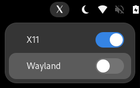

# X11 or Wayland GNOME Default Session Switch
A GNOME Shell extension that adds a X11 or Wayland session indicator to the top panel and allows the user to switch default session between X11 and Wayland.



1. This extension needs sudo password to execute.
2. You should logout and login or reboot to reflect the change in Windowing System.
3. Sometimes X11 will disable extensions at login, use (GUI) ```Gnome Extentions``` application or <br> (CLI) paste this in terminal ```gsettings set org.gnome.shell disable-user-extensions false``` to enable it.

## Installation
### From GNOME Extensions Website
<a href="https://extensions.gnome.org/extension/6145/switch-x11-wayland-default-session/">

</a>

### Manually

```
git clone https://github.com/prasanthc41m/switch-x11-wayland.git
cd switch-x11-wayland
make install
```
## How it works!!
By Default at the login screen, select the "gear" icon and select GNOME on Xorg.

As an alternative, this change can be made by editing a configuration file ```/etc/gdm/custom.conf```.

  Open ```/etc/gdm/custom.conf``` and uncomment the line:

  ```WaylandEnable=false```

  Add the following line to the ```[daemon]``` section:

  ```DefaultSession=gnome-xorg.desktop```

   Save the ```custom.conf``` file.

   This is done by toggleing X11 Wayland Switch extention.

   Logout or reboot to enter the new session.

> **Note**<br>
> With the above changes applied, the option to set the GNOME session to use Wayland will actually be removed from the "gear icon" menu on the login screen when you choose X11 as default but will return in Wayland.

> **Warning**<br>
> Nvidia Users: Wayland (and Xwayland) works under starting with NVIDIA driver 495 and later. With GNOME 41, Wayland can be selected explicitly with GDM. Older version will sometimes face issues like load X11 (Xorg) eventhough ```WaylandEnable=true``` beacuse wayland won't work with these propretory nvidia driver so forced to use X11.

### To-do 
:white_check_mark: Fix for enabling wayland for hybrid nvidia graphics on fedora
<br></br>
<br>
:information_source: Reference:<br>
https://docs.fedoraproject.org/en-US/quick-docs/configuring-xorg-as-default-gnome-session/
https://9to5linux.com/how-to-enable-wayland-for-hybrid-nvidia-graphics-on-fedora-linux-38-workstation
</br>
